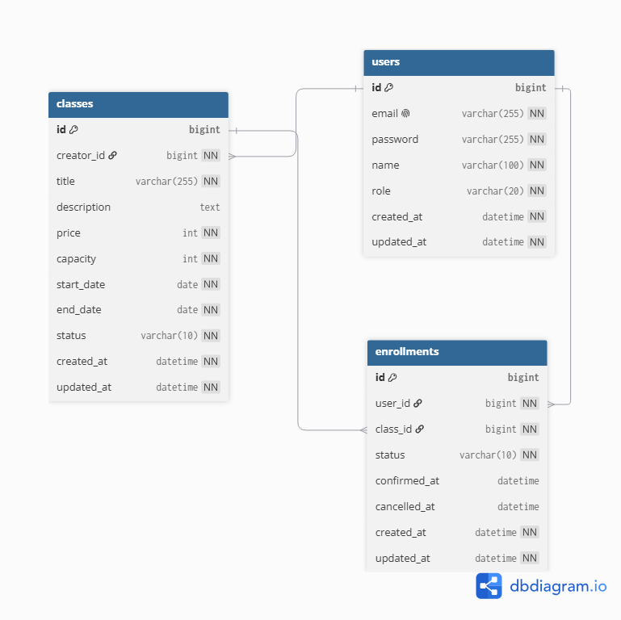

# 수강 신청 시스템

크리에이터가 강의를 개설하고, 클래스메이트가 신청·결제·취소하는 수강 신청 시스템의 백엔드 API입니다.

## 프로젝트 개요

- 크리에이터는 강의를 등록하고 모집 상태(DRAFT → OPEN → CLOSED)를 관리합니다.
- 클래스메이트는 OPEN 상태의 강의에 신청하고, 결제 확정 후 수강이 확정됩니다.
- 정원 초과 신청은 거부되며, 동시에 마지막 자리에 여러 명이 신청하는 상황에서도 정원이 깨지지 않도록 동시성 제어를 적용했습니다.
- 결제 확정 후 사용자는 본인의 신청을 취소할 수 있습니다.

## 기술 스택

| 분류 | 기술 |
| --- | --- |
| 언어/런타임 | Java 21 |
| 프레임워크 | Spring Boot 4.0.6, Spring Data JPA, Spring Validation, Spring Web MVC |
| 빌드 | Gradle |
| 데이터베이스 | MySQL 8.0 |
| 문서화 | springdoc-openapi (Swagger UI) |
| 테스트 | JUnit 5, AssertJ |
| 실행 환경 | Docker, Docker Compose |
| 보조 | Lombok |

## 실행 방법

### 사전 준비

- Docker Desktop 설치 및 실행

### 실행

프로젝트 루트에서:

```bash
docker compose up --build
```

### 접속 정보

- API Base URL: `http://localhost:8080`
- Swagger UI: `http://localhost:8080/swagger-ui.html`
- OpenAPI Docs (JSON): `http://localhost:8080/api-docs`

### 종료

```bash
docker compose down          # 컨테이너만 정리 (데이터 유지)
docker compose down -v       # 컨테이너 + 볼륨 삭제 (DB 초기화)
```

### 포트 안내

- 앱: `8080`
- MySQL: 호스트 `3307` → 컨테이너 `3306`. 
- 호스트에서 DB 접속 시: `localhost:3307`, user `root`, password `1234`

## 요구사항 해석 및 가정

- **인증**: Spring Security는 사용하지 않으며, `X-User-Id` 헤더로 사용자를 식별합니다. 회원가입/로그인 API는 범위 밖으로 보고 구현하지 않았습니다.
- **사용자 데이터**: 회원가입 API가 없으므로, API를 호출하려면 DB에 사용자 행을 직접 INSERT해야 합니다 (아래 [샘플 시드 데이터](#샘플-시드-데이터) 참고).
- **강의 상태 전이**: `DRAFT → OPEN → CLOSED` 단방향만 허용. 역방향이나 단계 건너뛰기는 거부됩니다.
- **DRAFT 강의 노출**: 초안 상태의 강의는 목록/상세 조회에서 노출하지 않습니다 (작성자 본인만 알 수 있는 비공개 상태로 해석).
- **수강 신청 가능 조건**: 강의 상태가 `OPEN`이어야 하며, 동일 강의에 활성(PENDING/CONFIRMED) 신청이 있는 사용자는 중복 신청 불가.
- **취소 가능 조건**: PENDING 또는 CONFIRMED 상태의 본인 신청만 취소 가능. 취소 가능 기간 제한은 선택 구현이라 적용하지 않았습니다.
- **시간 형식**: 모든 시각은 ISO-8601 (`LocalDateTime`). 컨테이너 타임존은 `Asia/Seoul`.

## 설계 결정과 이유

### 1. 정원 초과 방지를 위한 비관적 락

`enroll()` 시 `SELECT ... FOR UPDATE`로 Class를 잠금 → 정원 카운트 → 신청 저장 순서로 처리합니다.

- `ClassRepository.findByIdForUpdate()`에 `@Lock(PESSIMISTIC_WRITE)` 적용
- 락 타임아웃 3초 설정 (`jakarta.persistence.lock.timeout`)
- 마지막 자리에 동시 신청이 들어와도 직렬화되어 정원이 깨지지 않음

### 2. 결제 확정 / 취소는 조건부 UPDATE 쿼리

상태 변경은 "현재 상태가 X일 때만" 단일 SQL로 처리합니다.

```sql
UPDATE Enrollment
SET status = 'CONFIRMED', confirmed_at = ?
WHERE id = ? AND user_id = ? AND status = 'PENDING'
```

- 영향받은 행 수가 0이면 상태 전이 실패 → `INVALID_STATUS_TRANSITION` 반환
- 두 번의 동시 결제/취소 요청에 대해 한쪽만 성공하고 다른 쪽은 거부됨

### 3. 중복 신청 방지의 이중 안전장치

- 애플리케이션 레벨: `existsByUser_IdAndClazz_IdAndStatusIn` 사전 체크
- 데이터베이스 레벨: `enrollment` 테이블에 `(user_id, class_id)` UniqueConstraint

### 4. 에러 응답 통일

`GlobalExceptionHandler`에서 모든 예외를 `{ code, message }` 포맷으로 변환합니다. HTTP 상태 코드/도메인 코드/메시지는 `ErrorCode` enum에서 한곳에 관리.

| 케이스 | HTTP | code |
| --- | --- | --- |
| 검증 실패 | 400 | VALIDATION_FAILED |
| 권한 없음 | 403 | FORBIDDEN / CLASS_ACCESS_DENIED |
| 리소스 없음 | 404 | USER_NOT_FOUND / CLASS_NOT_FOUND / ENROLLMENT_NOT_FOUND |
| 비즈니스 위반 | 409 | INVALID_STATUS_TRANSITION / CLASS_NOT_OPEN / CLASS_FULL / ALREADY_ENROLLED |

## 미구현 / 제약사항

### 미구현 (선택 구현 항목)

- 수강 취소 가능 기간 제한 (예: 결제 후 7일 이내)
- 대기열(waitlist) 기능
- 강의별 수강생 목록 조회 (크리에이터 전용)
- 신청 내역 페이지네이션

### 제약사항

- **인증/인가 미구현**: `X-User-Id` 헤더 값을 그대로 신뢰합니다.
- **회원가입 API 없음**: 사전 과제 범위상 사용자 등록 API는 만들지 않았습니다. 테스트를 위해서는 DB에 직접 사용자를 추가해야 합니다.

## AI 활용 범위

본 과제는 Claude Code를 활용해 구현했습니다.
직접 수행한 부분과 AI에 위임한 부분, 그리고 검증 방식은 다음과 같습니다.

### 직접 수행한 부분

- **요구사항 분석 및 도메인 설계**: 엔티티 구조(User/Class/Enrollment), 상태 전이 규칙(DRAFT→OPEN→CLOSED, PENDING→CONFIRMED→CANCELLED), 비즈니스 제약(중복 신청 방지, 정원 초과 거부 등) 의사결정.
- **API 명세 설계**: 엔드포인트 URL, HTTP 메서드, 요청/응답 DTO 구조, 에러 코드 체계, 인증 방식 등을 명세 형태로 정리하여 AI에 전달.
- **테스트 시나리오 설계**: 정원 초과 동시 신청, 동시 결제 확정, 동시 취소 등 검증해야 할 동시성 시나리오를 정의.
- **동시성 제어 전략 결정**: 비관적 락(신청)과 조건부 UPDATE(결제/취소) 중 어떤 방식을 어디에 적용할지 선택.
- **AI 산출물 검토 및 수정**: 생성된 코드를 직접 읽고 의도와 다른 부분, 보완이 필요한 부분을 수정.

### AI에 위임한 부분

- 위 명세를 바탕으로 한 코드 구현 (Entity / Repository / Service / Controller / DTO / Exception 클래스 작성)
- 단위 테스트 및 동시성 통합 테스트 코드 작성
- Docker 실행 환경 구성 (`Dockerfile`, `docker-compose.yml`)
- README 초안 작성

### 검증 방식

- 모든 생성 코드는 직접 읽고 흐름을 이해한 뒤 반영했습니다.
- 테스트 코드 작성 후 실행하여 동작을 확인하고, 실패하는 케이스는 원인 파악 후 수정했습니다.
- Docker 실행은 로컬에서 직접 기동 및 API 호출로 검증했습니다.

## API 목록 및 예시

모든 요청에는 `X-User-Id` 헤더가 필요합니다. Content-Type은 `application/json`.

### 강의 (Class)

| Method | Path | 설명 |
| --- | --- | --- |
| POST | `/api/v1/classes` | 강의 등록 |
| POST | `/api/v1/classes/{classId}/status` | 강의 상태 변경 |
| GET | `/api/v1/classes?status=OPEN` | 강의 목록 (status 필터: OPEN/CLOSED) |
| GET | `/api/v1/classes/{classId}` | 강의 상세 (현재 신청 인원 포함) |

### 수강 신청 (Enrollment)

| Method | Path | 설명 |
| --- | --- | --- |
| POST | `/api/v1/enrollments` | 수강 신청 |
| POST | `/api/v1/enrollments/{enrollmentId}/payment` | 결제 확정 |
| POST | `/api/v1/enrollments/{enrollmentId}/cancel` | 수강 취소 |
| GET | `/api/v1/enrollments/me?status=CONFIRMED` | 내 수강 신청 목록 |

### 샘플 요청/응답

#### 강의 등록

```http
POST /api/v1/classes
X-User-Id: 1
Content-Type: application/json

{
  "title": "웹 프로그래밍 입문",
  "description": "웹 프로그래밍 기초부터 실전까지",
  "price": 80000,
  "capacity": 80,
  "startDate": "2026-06-01",
  "endDate": "2026-12-31"
}
```

```http
HTTP/1.1 201 Created
{
  "id": 1,
  "title": "웹 프로그래밍 입문",
  "status": "DRAFT",
  "creatorId": 1,
  "createdAt": "2026-05-23T14:00:00"
}
```

#### 강의 상태 변경

```http
POST /api/v1/classes/1/status
X-User-Id: 1
Content-Type: application/json

{ "status": "OPEN" }
```

```http
HTTP/1.1 200 OK
{ "id": 1, "status": "OPEN", "updatedAt": "2026-05-23T14:05:00" }
```

#### 수강 신청

```http
POST /api/v1/enrollments
X-User-Id: 2
Content-Type: application/json

{ "classId": 1 }
```

```http
HTTP/1.1 201 Created
{
  "id": 10,
  "classId": 1,
  "userId": 2,
  "status": "PENDING",
  "appliedAt": "2026-05-23T14:10:00"
}
```

#### 결제 확정

```http
POST /api/v1/enrollments/10/payment
X-User-Id: 2
```

```http
HTTP/1.1 200 OK
{ "id": 10, "status": "CONFIRMED", "confirmedAt": "2026-05-23T14:11:00" }
```

#### 수강 취소

```http
POST /api/v1/enrollments/10/cancel
X-User-Id: 2
```

```http
HTTP/1.1 200 OK
{ "id": 10, "status": "CANCELLED", "cancelledAt": "2026-05-23T14:12:00" }
```

#### 에러 응답 예시

```http
HTTP/1.1 409 Conflict
{ "code": "CLASS_FULL", "message": "정원이 가득 차 신청할 수 없습니다." }
```

## 데이터 모델 설명

### ERD (논리)



### 엔티티 설명

#### users

사용자. 역할에 따라 강의 등록 권한이 결정됩니다.

| 컬럼 | 타입 | 비고 |
| --- | --- | -- |
| id | bigint | PK |
| email | varchar | unique |
| password | varchar | |
| name | varchar | |
| role | enum | `CREATOR` / `CLASSMATE` |
| created_at, updated_at | datetime | JPA Auditing |

#### classes

강의. 생성 시 `DRAFT` 상태로 시작하며 크리에이터가 직접 `OPEN`/`CLOSED`로 전환합니다.

| 컬럼 | 타입 | 비고 |
| --- | --- | --- |
| id | bigint | PK |
| creator_id | bigint | FK → users.id |
| title | varchar | |
| description | text | nullable |
| price | int | 0 이상 |
| capacity | int | 1 이상 |
| start_date, end_date | date | end_date ≥ start_date |
| status | enum | `DRAFT` / `OPEN` / `CLOSED` |
| created_at, updated_at | datetime | JPA Auditing |

#### enrollment

수강 신청. 동일 사용자/강의 조합은 1건만 존재 (uk_enrollment_user_class).

| 컬럼 | 타입 | 비고 |
| --- | --- | --- |
| id | bigint | PK |
| user_id | bigint | FK → users.id |
| class_id | bigint | FK → classes.id |
| status | enum | `PENDING` / `CONFIRMED` / `CANCELLED` |
| confirmed_at | datetime | 결제 확정 시각 |
| cancelled_at | datetime | 취소 시각 |
| created_at, updated_at | datetime | JPA Auditing |

## 테스트 실행 방법

### 사전 준비

테스트는 `application-local.yaml` 설정(`localhost:3306`)을 사용하므로 로컬 MySQL이 필요합니다.

로컬에 MySQL이 설치되어 있다면 다음과 같은 DB를 준비:

- host: `localhost`, port: `3306`
- database: `course_registration`
- user: `root`, password: `1234`

### 실행

```bash
./gradlew test
```

### 포함된 테스트

- `ClassServiceTest`, `EnrollmentServiceTest`: 서비스 단위 테스트
- `ClassControllerTest`: 컨트롤러 슬라이스 테스트
- `EnrollmentConcurrencyTest`: 동시 신청에서 정원 초과가 발생하지 않는지 검증
- `PaymentConfirmConcurrencyTest`: 동시 결제 확정 요청에서 한쪽만 성공하는지 검증
- `CancelConcurrencyTest`: 동시 취소 요청에 대한 상태 전이 검증

## 샘플 시드 데이터

API 호출 전에 사용자를 DB에 직접 추가합니다.

```sql
-- 도커로 띄운 MySQL에 접속: localhost:3307, root / 1234
USE course_registration;

INSERT INTO users (email, password, name, role, created_at, updated_at)
VALUES
  ('creator@example.com', 'test',  '강사1',   'CREATOR',   NOW(), NOW()),
  ('mate1@example.com',   'test',  '수강생1', 'CLASSMATE', NOW(), NOW()),
  ('mate2@example.com',   'test',  '수강생2', 'CLASSMATE', NOW(), NOW());
```

이후 `X-User-Id: 1` (강사) / `X-User-Id: 2,3` (수강생)으로 API를 호출할 수 있습니다.
